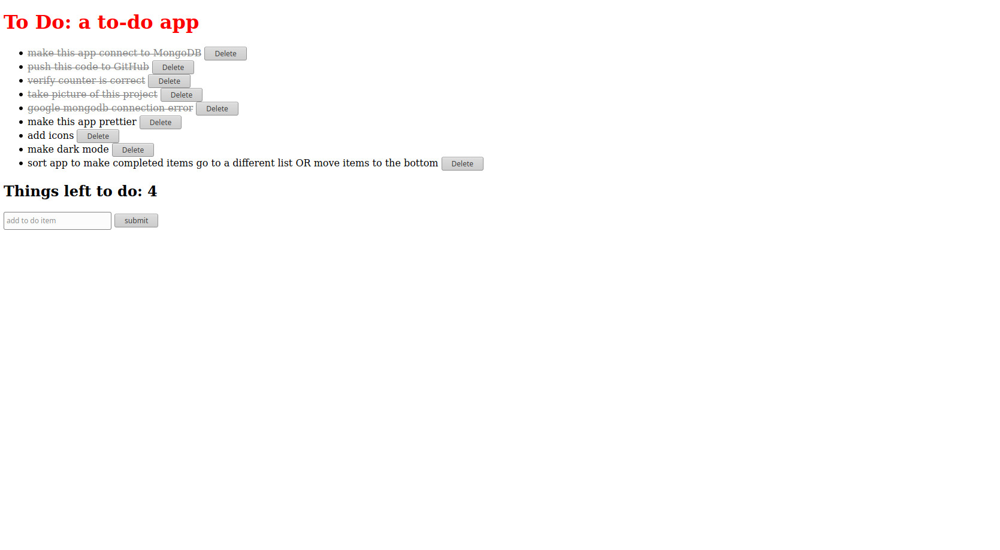

# My To Do App
This is a very simple CRUD application.
Check out the <a target="_blank" href="https://github.com/xcChinaxc/to-do-app">Repo</a> and the <a target="_blank" href="https://cr-to-do-app.herokuapp.com/">Site</a>

## How It's Made
**Tech used:** HTML, CSS, JavaScript, Embedded JavaScript, Node.js, Express, MongoDB